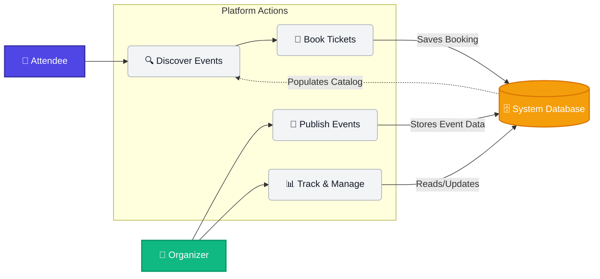

# 🌟 Event Management Platform 🌟
*A modern, full-stack solution for discovering, booking, and managing events seamlessly.*

<!-- Badges -->
    

---

## 📖 Problem Statement

Organizing and discovering events is often a fragmented and frustrating experience. 
- **For Event Attendees**: Discovering relevant events, securely booking tickets, and keeping track of their upcoming schedule is spread across multiple platforms.
- **For Event Organizers**: Creating events, managing ticket sales, and reaching the right audience requires complex tools and high fees.

**Solution**: This Event Management Platform bridges the gap by providing a unified, intuitive, and secure environment where organizers can effortlessly publish events, and users can seamlessly discover and book them.

---

## 🎯 Minimum Viable Product (MVP)

The initial version of the platform includes the following core functionalities:

1. **User Authentication & Authorization**: Secure login and registration with Role-Based Access Control (RBAC) separating `Users` and `Organizers`.
2. **Event Discovery**: A landing page to browse all available events with basic details.
3. **Event Booking**: Users can view event details and book tickets securely.
4. **Attendee Dashboard**: A personalized space for users to view and manage their bookings.
5. **Organizer Dashboard**: Dedicated tools for organizers to create new events and monitor the events they host.

---

## 🛠 Tech Stack

Built with the modern **MERN** stack to ensure scalability, performance, and a smooth developer experience.

### **Frontend**
- **React.js (v19)**: Component-based UI development.
- **React Router (v7)**: Seamless client-side routing.
- **Framer Motion**: Fluid, beautiful micro-animations and transitions.
- **Lucide React**: Clean and consistent iconography.
- **Context API**: Global state management for Authentication and UI Toasts.

### **Backend**
- **Node.js & Express.js**: Fast and minimalist web framework for the API.
- **MongoDB & Mongoose**: Flexible NoSQL database and Object Data Modeling (ODM).
- **JWT (JSON Web Tokens)**: Secure stateless authentication.
- **Bcrypt.js**: Cryptographic password hashing.
- **Express Validator**: Robust request data validation.

---

## 🔄 Workflow Diagram



---

## 🚀 Getting Started

Follow these instructions to get a copy of the project up and running on your local machine for development and testing purposes.

### Prerequisites
- [Node.js](https://nodejs.org/) (v16 or higher)
- [MongoDB](https://www.mongodb.com/) (Local instance or MongoDB Atlas cluster)

### Installation

1. **Clone the repository**
   ```bash
   git clone <repository-url>
   cd event-management
   ```

2. **Install dependencies**
   ```bash
   npm install
   ```
   *(Note: The repository uses a unified package.json utilizing `concurrently` to run both frontend and backend)*

3. **Environment Setup**
   Create a `.env` file in the root directory and add the following variables:
   ```env
   PORT=5000
   MONGO_URI=your_mongodb_connection_string
   JWT_SECRET=your_super_secret_jwt_key
   JWT_EXPIRE=30d
   ```

4. **Seed the Database (Optional)**
   To populate the database with sample data:
   ```bash
   npm run seed
   ```

5. **Run the Application**
   Start both the backend server and the frontend React application concurrently:
   ```bash
   npm run dev
   ```
   - **Frontend**: [http://localhost:3000](http://localhost:3000)
   - **Backend API**: [http://localhost:5000](http://localhost:5000)

---

## 📂 Project Structure

```text
event-management/
├── public/                 # Static assets
├── server/                 # Backend Node.js/Express application
│   ├── config/             # Database connection & configurations
│   ├── middleware/         # Custom Express middlewares (Auth, Error handling)
│   ├── models/             # Mongoose schemas (User, Event, Booking)
│   ├── routes/             # API endpoints definitions
│   ├── seed/               # Database seeder scripts
│   └── server.js           # Backend entry point
├── src/                    # Frontend React application
│   ├── components/         # Reusable UI components & layouts
│   ├── context/            # React Context (AuthContext, ToastContext)
│   ├── pages/              # Route-level components (Landing, Login, Dashboard)
│   ├── services/           # API interaction layer
│   ├── utils/              # Helper functions
│   ├── App.js              # Main React component & Router config
│   └── index.css           # Global styles
├── .env                    # Environment variables
└── package.json            # Project metadata and dependencies
```

---

<div align="center">
  <p>Built with ❤️ using the MERN Stack</p>
</div>
